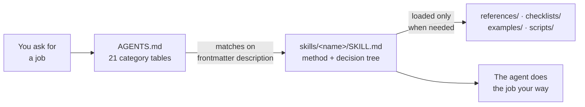
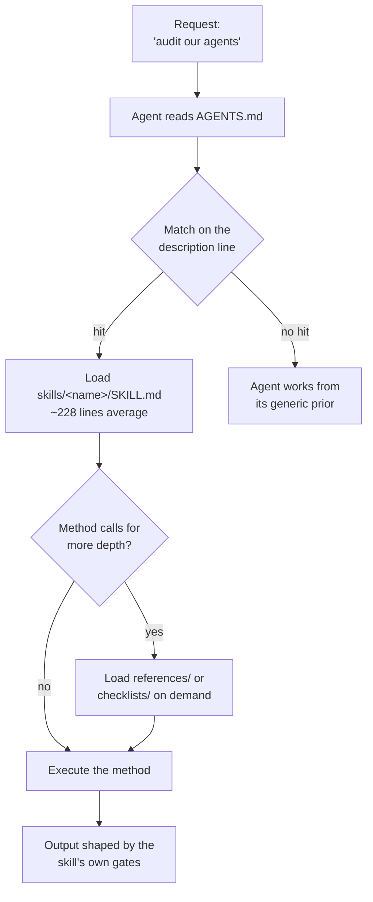

# agentskills

Agent skills for Claude Code and other file-reading coding agents

**Status:** Maintained · 168 `SKILL.md` files · MIT · public

[](./LICENSE)
[](./AGENTS.md)

[Skill index](./AGENTS.md) · [Contributing](./CONTRIBUTING.md) · [Skill authoring](./skills/white-paper-writing/blastum-skill-authoring/SKILL.md) · [Agent Skills spec](https://agentskills.io) · [Claude Code skills docs](https://code.claude.com/docs/en/skills)

|  |  |
|---|---|
| **What it is** | A library of 168 `SKILL.md` procedures that teach a coding agent a job |
| **Who it's for** | Anyone driving Claude Code, Cursor, Windsurf, Codex or Gemini CLI |
| **Live at** | [github.com/ever-just/agentskills](https://github.com/ever-just/agentskills) — the repo *is* the product; there is no hosted service and no account |
| **Stack** | Markdown + YAML frontmatter · no build step · zero runtime dependencies |
| **Status** | Maintained · 168 skills across 130 directories · 70 commits · 26 merged PRs · last skill landed 2026-08-14 |

A skill is a single Markdown file that tells an agent how to do one job properly: the method,
the decision tree, the commands, and the mistakes that were actually made the first time.
This repo holds 168 of them, written while shipping real systems and corrected afterwards.
Clone it, drop the directories you want into your agent's skills folder, and the agent stops
improvising.



---

## The problem

A coding agent will attempt almost anything you ask it, and it will do most of it from a
generic prior. Ask for a research pass and you get three web searches and a summary. Ask it to
audit a production system and it samples a few records and reports that things look fine. Ask
it to verify a company's partner list and it reads the logo wall and believes it. The work
looks finished. It is wrong in the tail, which is exactly where the findings live.

The gap is not intelligence, it is procedure — the ordering, the rate limits, the source that
has to be checked before the obvious one, the trap that ate two hours last time. That
knowledge normally lives in one person's head and gets re-derived by every agent, every
session. Writing it down once, in the format the agent already reads, is the whole idea here.

---

## Quickstart

Clone the repo. Nothing installs, nothing builds, nothing runs.

```bash
git clone https://github.com/ever-just/agentskills.git
cd agentskills
```

**Use one skill in Claude Code.** Personal skills live in `~/.claude/skills/`, project skills
in `.claude/skills/` — one directory per skill, each containing a `SKILL.md`:

```bash
mkdir -p ~/.claude/skills
cp -R skills/production-agent-audit ~/.claude/skills/
cp -R skills/deep-research         ~/.claude/skills/
```

**Use it with any file-reading agent.** Point the agent at the manifest and let it choose:

```text
Read AGENTS.md in this repo, pick the skill that fits, then follow it exactly.
I need to audit what our deployed agents have been doing for the last three weeks.
```

**Read one without installing anything:**

```bash
cat skills/production-agent-audit/SKILL.md
less skills/deep-research/AGENT_SKILL_DEEP_RESEARCH.md
```

Requirements: `git`, and an agent that can read files. Individual skills name their own tools
(FFmpeg for video, Python 3.9+ for the Python pipelines, Node.js 18+ for the JS ones); the
repo itself has none.

---

## What it does

Every bullet below points at a file in this repo. The numbers are recorded runs, not estimates.

- **Audit a deployed AI-agent product from its own exhaust** — census, then total extraction
  from database + request logs + container stdout + error tracker, every record read rather
  than sampled, every claim triangulated across ≥2 sources before it becomes a finding →
  `skills/production-agent-audit/SKILL.md`
- **Run a research pass that finds what search engines miss** — the seven-phase pipeline
  (plan → local → search → Wayback → scrape → synthesise → report). Its worked example
  recovers 26 PDFs from the Wayback CDX index that Google never returned, plus nine years of
  conference schedules and 625 speaker records → `skills/deep-research/`
- **Stop believing a logo wall** — verify claimed OEM partnerships against each manufacturer's
  own directory. The run that produced the skill confirmed **2 of ~40** claimed partnerships,
  which changed the assessment of the target entirely →
  `skills/oem-partner-verification/SKILL.md`
- **Find a private company's customers from public sources** — twelve cross-referenced source
  classes and a tiered confidence framework; the validating run turned one publicly named
  client into 6 confirmed, 6 probable, 17 event sponsors and 10 warm-network connections →
  `skills/client-discovery-osint/SKILL.md`
- **Review thousands of images without burning a context window** — auto-classify, then batch
  into 6×6 contact sheets for vision review; 10–33× throughput depending on image complexity →
  `skills/contact-sheet-image-analysis/SKILL.md`
- **Recover work that never reached `main`** — mine agent session transcripts up to 150 MB
  with streaming `grep`/`jq`, then sweep for unmerged branches, stashes and dangling commits →
  `skills/claude-session-archaeology/SKILL.md`, `skills/unmerged-work-census/SKILL.md`
- **Roll a production change back without making it worse** — culprit binding, the
  later-commit dependency check, and an explicit list of what a revert does *not* undo →
  `skills/production-revert-discipline/SKILL.md`
- **Attribute a production change with no server access** — map CI/CD run logs to commit
  ranges to targets, and separate *caused* from *merely exposed* →
  `skills/deploy-log-forensics/SKILL.md`
- **Operate a multi-tenant Odoo 19 platform** — 33 skills covering mail, mass mailing, CRM,
  appointments, telephony, e-signature, payroll, the website surface and zero-downtime
  blue/green deploys → `skills/everjust-*/`
- **Make a site answerable by AI engines, not just indexable** — JSON-LD authored from visible
  content, robots/llms.txt reality checks, and the MCP-server discovery chain →
  `skills/generative-engine-optimization/`, `skills/agent-discoverability/`
- **Render video, animation and slides locally** — Remotion, Motion Canvas, Manim, GSAP,
  Lottie, MoviePy, D3, Slidev. No API keys; everything runs on your machine →
  `skills/remotion/`, `skills/manim/`, `skills/gsap/`
- **Write like a person** — co-authoring, prose repair, de-AI-ification, concision, and export
  to DOCX or PDF → `skills/white-paper-writing/`

---

## What it covers

Twenty-one categories, indexed in [`AGENTS.md`](./AGENTS.md). The seven largest:

| Family | Skills | What it is for |
|---|---:|---|
| EVERJUST platform (Odoo 19 multi-tenant) | 33 | Operating one specific self-hosted SaaS platform end to end |
| Platform operations | 29 | Deploys, DNS, error tracking, schema audits, render verification, CI/CD |
| Research, OSINT & competitive intelligence | 22 | Dossier construction, source verification, extraction from hostile surfaces |
| Writing, marketing & content | 41 | Long-form docs, copy, positioning, launch, export — a nested family |
| Video, animation & presentation | 13 | Programmatic video, motion graphics, slides, data visualisation |
| AI-agent auditing & forensics | 6 | Grading deployed agents, remediation backlogs, temporal validation |
| Odoo platform development (generic) | 4 | Migration, Community/Enterprise parity, multi-tenant patterns, deploys |

The OSINT and dossier skills are written for the public record: company filings, archived
pages, sponsor lists, job posts, court and lien indexes. Several document their own failure
modes — `era-validated-linkedin-analysis` exists solely because a previous run misattributed
work across employers, and says so.

---

## How it's organised

The repo is a flat library plus two indexes. `AGENTS.md` is the machine-first manifest: an
agent reads it, matches a request against the `description` line of each skill, and loads only
that skill's `SKILL.md`. `README.md` mirrors it for humans. Large skills use progressive
disclosure — a lean `SKILL.md` that navigates, with depth in `references/`, `checklists/`,
`examples/` and `scripts/` that load only when the agent needs them. Nothing here executes on
load and nothing depends on anything outside its own directory, so a skill directory copied
into another agent's skills folder still works.

### Repository layout

```text
.
├── AGENTS.md                       # discovery manifest — 21 category tables, read first by agents
├── README.md                       # this file; the human-facing mirror of AGENTS.md
├── CONTRIBUTING.md                 # skill anatomy, naming, registration, multi-agent lane rules
├── LICENSE                         # MIT
├── rules/
│   └── visual-creation-rules.md    # cross-skill rules shared by the video/animation family
├── templates/
│   └── project-scaffolds.md        # scaffold commands several skills call out to
└── skills/                         # 130 top-level directories, 168 SKILL.md files
    ├── production-agent-audit/     # single-file skill — SKILL.md and nothing else
    ├── deep-research/              # multi-file skill — methodology, quick reference, examples
    ├── system-design-architecture/ # the 3-entry-point shape: SKILL.md → references/INDEX.md → README.md
    ├── everjust-*/                 # 33 skills for one Odoo 19 multi-tenant platform
    └── white-paper-writing/        # nested family: 18 writing skills + ai-marketing-skills/ (23 more)
```

### The pieces

| Component | Path | What it is | Talks to |
|---|---|---|---|
| Discovery manifest | `AGENTS.md` | 21 category tables, one row per skill, plus a decision tree and a combining-patterns list | Every skill; read first by the agent |
| Human index | `README.md` | This page — positioning, architecture, and the family index | Links to `AGENTS.md` for the per-skill rows |
| Contributor contract | `CONTRIBUTING.md` | Anatomy, naming, registration, the pre-PR gate, the anti-patterns | Points at the authoring skill |
| Authoring toolkit | `skills/white-paper-writing/blastum-skill-authoring/` | `new-skill.sh`, `lint-skill.sh`, `validate-skill.sh` plus the authoring method | Reads any skill directory |
| A skill | `skills/<name>/SKILL.md` | Frontmatter + method + decision tree + pitfalls | Cross-links siblings by relative path |
| Skill depth | `skills/<name>/references/`, `checklists/`, `examples/`, `scripts/` | On-demand material, loaded only when the method calls for it | Its own `SKILL.md` |
| Shared rules | `rules/`, `templates/` | Cross-skill conventions and scaffolds | The families that reference them |

### How a skill reaches the agent



### Invariants

- **Nothing in this repo executes.** There is no `package.json`, no lockfile, no install step
  and no runtime dependency. A skill is text an agent reads.
- **There is no CI and no build.** The lint and validate scripts are run by hand before a PR.
  A skill that is not appended to `AGENTS.md` is invisible to an agent that starts from the
  manifest, however good the skill is.
- **One skill = one directory = one responsibility.** A skill never edits, renames or
  "improves" another skill; a contributor's diff touches its own directory plus two manifest
  rows.
- **Every internal link is relative.** That is what lets a directory be copied into any agent's
  skills folder and still resolve.
- **Manifest rows are appended, never reordered.** Re-sorting a shared table turns a one-line
  diff into a whole-table conflict for every agent working concurrently.

Entry points: `AGENTS.md` (machine), `README.md` (human), `skills/<name>/SKILL.md` (per skill),
`CONTRIBUTING.md` (before writing one).

<!-- architecture verified against 876ff8cbd1e693b73ed6d34a061a4190974c4acc, 2026-09 -->

---

## Configuration

There are no environment variables, because nothing here runs. The configuration surface is
the YAML frontmatter at the top of each `SKILL.md` — this is what an agent harness matches on.

| Field | Required | Default | Purpose |
|---|---|---|---|
| `name` | yes | — | Lowercase, hyphens, ≤64 chars, identical to the directory name |
| `description` | yes | — | ≤1024 chars. What it does **and** when to use it, in the words a user would say. This single line decides whether the skill is ever loaded |
| `version` | no | — | Present on 12 of 168 skills; imported skills that carry one keep it |
| `license` | no | repo MIT | Present on 8 skills imported from other authors under their own terms |
| `tags`, `author`, `metadata` | no | — | Carried through from imported skills; not used for matching |

Where each harness looks for a skill directory:

| Harness | Path | Notes |
|---|---|---|
| Claude Code (personal) | `~/.claude/skills/<name>/SKILL.md` | Available in every project |
| Claude Code (project) | `.claude/skills/<name>/SKILL.md` | Committed with the repo it belongs to |
| Windsurf / Cascade | `.windsurf/rules/`, or name the path in the prompt | Reference the file directly |
| Cursor | `.cursorrules`, or name the path in the prompt | Reference the file directly |
| Anything else | Any path | Point the agent at `AGENTS.md` and let it choose |

No credentials belong in this repo, in a skill, or in a skill's examples. Skills that describe
an authenticated API name the environment variable and stop there.

---

## Development

Prerequisites: `bash` 3.2+ (macOS stock), `git` 2.30+. Nothing else, for the repo itself.

```bash
# scaffold a new skill (simple = one SKILL.md; complex = the progressive-disclosure shape)
./skills/white-paper-writing/blastum-skill-authoring/scripts/new-skill.sh my-skill simple

# check it before opening a PR
./skills/white-paper-writing/blastum-skill-authoring/scripts/lint-skill.sh     skills/my-skill
./skills/white-paper-writing/blastum-skill-authoring/scripts/validate-skill.sh skills/my-skill
```

`lint-skill.sh` fails on missing frontmatter, a `name` over 64 characters or not `kebab-case`,
a `description` over 1024 characters, or a `SKILL.md` over 500 lines; it warns above 100 lines
and on Windows-style paths. The average skill is ~228 lines.

---

## Testing

There is no test suite — there is no code to test. The gate is
[`CONTRIBUTING.md` §6](./CONTRIBUTING.md), run by hand before every PR:

- `SKILL.md` exists, frontmatter has `name` matching the directory and a keyword-rich `description`
- Body is focused; heavy material moved into on-demand sub-files
- Every internal link resolves — no dangling `references/…` or `../sibling/…`
- Registered in `AGENTS.md` under the right category, appended rather than reordered
- No secrets, no stray files, external links verified to resolve
- The diff touches only the new skill directory and its two manifest rows

---

## Deployment and operations

| Class | Trigger | Effect |
|---|---|---|
| New or edited skill | Draft PR from a branch touching one skill directory + two manifest rows | Merged to `main` by a human; live to every consumer on their next `git pull` |
| Convention change | Its own PR, with a stated reason | Changes how every future skill is written; never bundled with a skill |
| Consumer install | `cp -R skills/<name> ~/.claude/skills/` | Takes effect on the agent's next session |

There is no server, no pipeline and no release. Distribution is `git pull`, or a copy of one
directory. Consumers who want reproducibility should vendor the directory they use, or pin a
commit — there are no tags and no releases to pin instead.

**Rollback:** `git revert <sha>` on `main` for a bad skill, or `git checkout <good-sha> --
skills/<name>/` for a bad edit inside one. On the consumer side, delete the copied directory —
removing a skill removes the behaviour, since nothing else in the agent depends on it.

---

## Known limitations

- **45 of 168 `SKILL.md` files have no YAML frontmatter.** Harnesses that auto-discover skills
  by frontmatter will not see them. They still work when read by path, or through `AGENTS.md`.
- **Five skills exceed the repo's own 500-line lint ceiling.** They are the oldest large ones
  and have not been split into the progressive-disclosure shape yet.
- **The manifest is maintained by hand.** With no CI, a skill can be merged without ever being
  registered in `AGENTS.md`, and nothing will flag it. `AGENTS.md` is the index to trust; this
  README indexes families, not individual skills.
- **33 of the skills describe one specific Odoo 19 platform.** The method inside them
  generalises; the model names, module names and tenant behaviour do not.
- **Receipts are single runs, not benchmarks.** "2 of 40 partnerships confirmed" and "10–33×
  image throughput" are what happened once, on real data, recorded honestly. Treat them as
  evidence that the method has been exercised, not as a guaranteed rate.
- **No versioning.** No tags, no releases, no changelog. `git log` is the history.

---

## Contributing

Read [`CONTRIBUTING.md`](./CONTRIBUTING.md) first — it is written for agents as much as for
people, because most of the commits here are made by one. One skill per branch, one skill per
PR, opened as a draft, touching only your own directory and your appended manifest row.
Do not merge your own PR.

New skills qualify only if all four hold: an agent can produce working output from the skill
alone; the instructions have been run and verified; there are no undocumented dependencies;
and it will be updated when the underlying tool changes.

## Security

No credentials, tokens, internal hostnames or customer data belong in any committed file. If
you find something that looks like one, open an issue without quoting the value.

## License

[MIT](./LICENSE) © EVERJUST. Skills imported from other authors carry their original licence
in their own frontmatter; that licence governs those directories.

Maintained by [EVERJUST](https://github.com/ever-just) — the same procedures that run
[customagents.io](https://customagents.io) and the rest of the estate.
