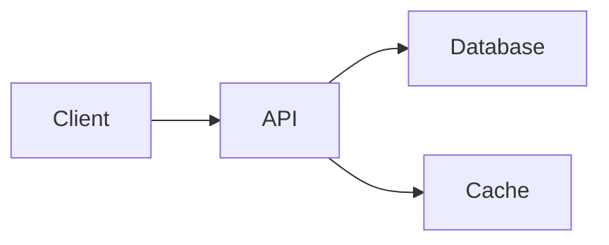

# Slidev — Presentation Slides for Developers

> Write animated, interactive presentations in Markdown with Vue components. Export to PDF, PNG, or deploy as SPA.

## Overview

- **Repo**: github.com/slidevjs/slidev (34K+ stars)
- **Language**: TypeScript / Vue / Markdown
- **License**: MIT
- **Install**: `npm init slidev@latest`
- **Docs**: sli.dev

## Setup

```bash
# Create new presentation
npm init slidev@latest my-slides

# Or start from scratch
mkdir my-slides && cd my-slides
npm init -y
npm install @slidev/cli @slidev/theme-default
echo "# My Presentation\n\nHello World" > slides.md
npx slidev
```

## Slide Syntax

Slides are separated by `---` in a single `slides.md` file:

```md
---
theme: default
title: My Presentation
drawings:
  persist: false
transition: slide-left
---

# Slide 1 Title

Content here

---

# Slide 2

- Bullet points
- With **bold** and *italic*

---
layout: center
---

# Centered Slide

---
layout: two-cols
---

# Left Column

Content on the left

::right::

# Right Column

Content on the right
```

## Layouts

Built-in layouts: `default`, `center`, `cover`, `two-cols`, `image-right`, `image-left`, `image`, `iframe-right`, `iframe-left`, `intro`, `none`, `quote`, `section`, `statement`, `fact`, `full`.

```md
---
layout: cover
background: https://example.com/bg.jpg
---

# Cover Slide
Subtitle text
```

## Animations & Transitions

### Click Animations (Fragments)

```md
# Animated List

<v-clicks>

- First point (appears on click 1)
- Second point (appears on click 2)
- Third point (appears on click 3)

</v-clicks>
```

### v-motion Directive (Framer Motion-like)

```html
<div
  v-motion
  :initial="{ x: -80, opacity: 0 }"
  :enter="{ x: 0, opacity: 1, transition: { delay: 200 } }"
>
  Animated element
</div>
```

### Slide Transitions

```md
---
transition: fade-out
---

# Fade Out Slide

---
transition: slide-left
---

# Slide Left

---
transition: slide-up
---
```

Available transitions: `fade`, `fade-out`, `slide-left`, `slide-right`, `slide-up`, `slide-down`, `view-transition`.

### Custom CSS Animations

```html
<style>
.slidev-vclick-target {
  transition: all 0.5s ease;
}
.slidev-vclick-hidden {
  opacity: 0;
  transform: translateY(20px);
}
</style>
```

## Vue Components in Slides

```md
# Interactive Slide

<Counter :count="10" />

<script setup>
import Counter from './components/Counter.vue'
</script>
```

## Code Blocks

### Syntax Highlighting

````md
```ts {2-3|5|all}
function hello() {
  // highlighted first (lines 2-3)
  const name = "world"

  return `Hello ${name}` // highlighted second (line 5)
}
```
````

### Shiki Magic Move (Animated Code Changes)

````md
````md magic-move
```ts
const greeting = "hello"
```
```ts
const greeting = "hello"
const name = "world"
```
```ts
function greet(name: string) {
  return `Hello ${name}`
}
```
````
````

## Diagrams (Mermaid)

```md
# Architecture


```

## LaTeX Math

```md
# Equation

$$
\int_0^\infty e^{-x^2} dx = \frac{\sqrt{\pi}}{2}
$$

Inline: $E = mc^2$
```

## Commands

```bash
# Start dev server (live preview)
npx slidev

# Export to PDF
npx slidev export

# Export to PNG (one per slide)
npx slidev export --format png

# Build as SPA
npx slidev build

# Serve built SPA
npx slidev build --serve
```

## Frontmatter Options

```yaml
---
theme: default           # Theme name
title: My Talk           # Presentation title
info: |
  Description of the talk
class: text-center       # Apply class to all slides
drawings:
  persist: false         # Save drawings
transition: slide-left   # Default transition
mdc: true               # Enable MDC syntax
---
```

## Best Practices

1. **One idea per slide** — Keep slides focused
2. **Use v-clicks for reveals** — Build up complex ideas progressively
3. **Use layouts** — `two-cols`, `center`, `image-right` for visual variety
4. **Code with highlights** — `{2-3|5}` to focus attention on specific lines
5. **Mermaid for diagrams** — No image files needed
6. **Vue components** for interactive demos
7. **Magic Move** for animated code evolution
8. **Export to PDF** for sharing, SPA for presenting

## When to Use Slidev

- Developer conference talks
- Technical presentations with code
- Team standups / sprint demos
- Architecture decision presentations
- Product feature overviews (for technical audiences)
- Educational workshops

## Source

- Repo: github.com/slidevjs/slidev
- Themes: sli.dev/resources/theme-gallery
- Add-ons: sli.dev/resources/addon-gallery
